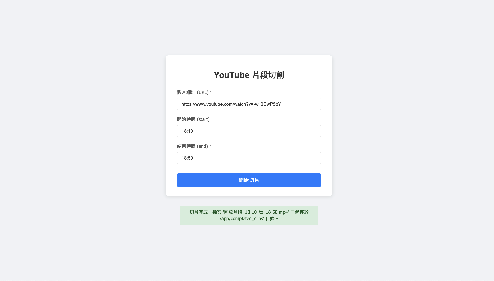

# 🎬 YouTube Clipper

Flask 網頁應用，可下載 YouTube 影片片段（剪輯），支援 yt-dlp、自動剪輯與 Chrome 資料夾掛載。

---

## 📦 環境需求

- Python 3.9+
- [Poetry](https://python-poetry.org/)
- Docker（可選）

---

## 🚀 本地開發（不使用 Docker）

### 1. 安裝 Poetry

```bash
curl -sSL https://install.python-poetry.org | python3 -
````

### 2. 安裝相依套件

```bash
poetry install
```

### 3. 執行應用程式

```bash
poetry run python3 -m app
```

若埠號 5000 被佔用，可改用：

```bash
poetry run python3 -m app --port 5001
```

---

## 🐳 使用 Docker 執行

### 1. 建立 Docker 映像檔

```bash
docker build -t yt-clipper .
```

### 2. 執行容器

```bash
docker run -p 5001:5001 --rm --name my-clipper \
  -v "$HOME/Library/Application Support/Google/Chrome/Default:/root/.config/google-chrome/Default:ro" \
  -v "$(pwd)/downloads:/app/downloads" \
  -e FLASK_SECRET_KEY='your_very_secret_random_key' \
  yt-clipper
```

不使用 cookie
```bash
docker run -p 5001:5001 --rm --name my-clipper \
  -v "$(pwd)/downloads:/app/downloads" \
  -e FLASK_SECRET_KEY='your_very_secret_random_key' \
  yt-clipper
```

* 將 YouTube cookies（例如登入憑證）從本地 Chrome 資料夾掛載進容器，以支援私人影片或高齡限制。
* 所有下載的影片會儲存在本機的 `downloads/` 資料夾中。

---

## 📁 專案結構

```
.
├── app.py               # 主應用程式入口
├── templates/           # Flask HTML templates
├── downloads/           # 影片下載目錄（Docker 掛載）
├── pyproject.toml       # Poetry 專案定義
├── poetry.lock          # 鎖定依賴版本
├── Makefile             # 自動化指令（可選）
└── Dockerfile           # Docker 設定
```

---

## ⚙️ 環境變數

| 變數名稱               | 說明                 | 範例                              |
| ------------------ | ------------------ | ------------------------------- |
| `FLASK_SECRET_KEY` | Flask Session 加密金鑰 | `'your_very_secret_random_key'` |

---

https://github.com/yt-dlp/yt-dlp/wiki/Extractors#logging-in-with-oauth

📊 速率限制參考（預設設定）：

訪客模式：約 300 部影片/小時（約 1000 次請求）

登入帳號：約 2000 部影片/小時（約 4000 次請求）


---

## 功能圖片




## 📝 TODO

* [ ] 支援影片剪輯（start / end）
* [ ] 支援多影片批次處理
* [ ] 支援格式選擇與字幕

---


## 🧑‍💻 作者

Created by \[Jonah Yen] — MIT License

